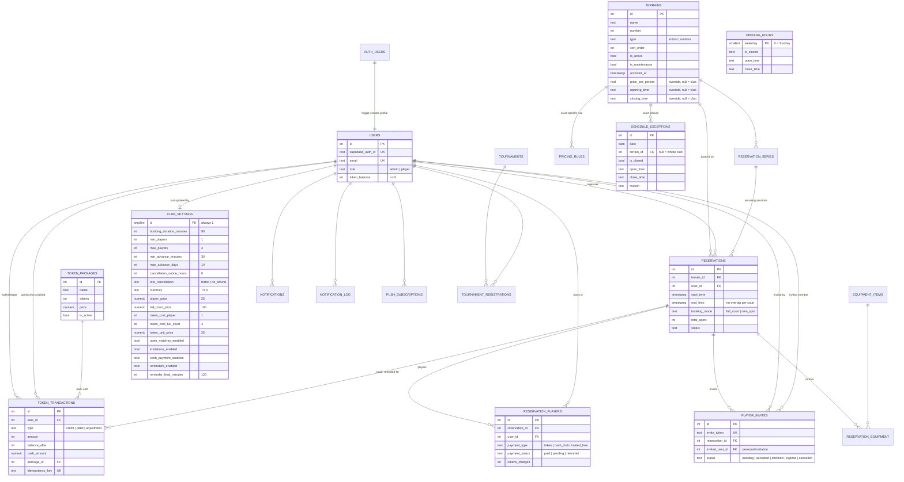
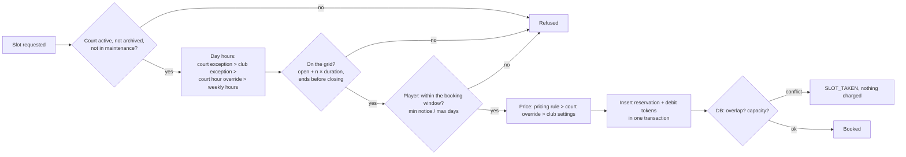

# Database diagram

One database per club (no tenant id). Main entities and relations; see
`docs/DATABASE.md` for every table and the rules the database enforces.

```mermaid
erDiagram
    AUTH_USERS ||--|| USERS : "trigger creates profile"
    USERS ||--o{ TOKEN_TRANSACTIONS : "wallet ledger"
    USERS ||--o{ TOKEN_TRANSACTIONS : "admin who credited"
    TOKEN_PACKAGES ||--o{ TOKEN_TRANSACTIONS : "pack sold"
    RESERVATIONS ||--o{ TOKEN_TRANSACTIONS : "paid / refunded for"

    TERRAINS ||--o{ RESERVATIONS : "booked on"
    USERS ||--o{ RESERVATIONS : "organiser"
    RESERVATIONS ||--o{ RESERVATION_PLAYERS : "players"
    USERS ||--o{ RESERVATION_PLAYERS : "plays in"
    RESERVATIONS ||--o{ PLAYER_INVITES : "invites"
    USERS ||--o{ PLAYER_INVITES : "invited by"
    USERS ||--o{ PLAYER_INVITES : "invited member"
    RESERVATION_SERIES ||--o{ RESERVATIONS : "recurring sessions"
    TERRAINS ||--o{ RESERVATION_SERIES : ""
    RESERVATIONS ||--o{ RESERVATION_EQUIPMENT : "rentals"
    EQUIPMENT_ITEMS ||--o{ RESERVATION_EQUIPMENT : ""

    TERRAINS ||--o{ PRICING_RULES : "court-specific rule"
    TERRAINS ||--o{ SCHEDULE_EXCEPTIONS : "court closure"
    USERS ||--o| CLUB_SETTINGS : "last updated by"

    USERS ||--o{ NOTIFICATIONS : ""
    USERS ||--o{ NOTIFICATION_LOG : ""
    USERS ||--o{ PUSH_SUBSCRIPTIONS : ""
    TOURNAMENTS ||--o{ TOURNAMENT_REGISTRATIONS : ""
    USERS ||--o{ TOURNAMENT_REGISTRATIONS : ""

    CLUB_SETTINGS {
        smallint id PK "always 1"
        int booking_duration_minutes "90"
        int min_players "1"
        int max_players "4"
        int min_advance_minutes "30"
        int max_advance_days "14"
        int cancellation_notice_hours "0"
        text late_cancellation "forbid | no_refund"
        text currency "TND"
        numeric player_price "25"
        numeric full_court_price "100"
        int token_cost_player "1"
        int token_cost_full_court "4"
        numeric token_unit_price "25"
        bool open_matches_enabled
        bool invitations_enabled
        bool cash_payment_enabled
        bool reminders_enabled
        int reminder_lead_minutes "120"
    }
    OPENING_HOURS {
        smallint weekday PK "0 = Sunday"
        bool is_closed
        text open_time
        text close_time
    }
    SCHEDULE_EXCEPTIONS {
        int id PK
        date date
        int terrain_id FK "null = whole club"
        bool is_closed
        text open_time
        text close_time
        text reason
    }
    TERRAINS {
        int id PK
        text name
        int number
        text type "indoor | outdoor"
        int sort_order
        bool is_active
        bool is_maintenance
        timestamp archived_at
        real price_per_person "override, null = club"
        text opening_time "override, null = club"
        text closing_time "override, null = club"
    }
    USERS {
        int id PK
        text supabase_auth_id UK
        text email UK
        text role "admin | player"
        int token_balance ">= 0"
    }
    TOKEN_TRANSACTIONS {
        int id PK
        int user_id FK
        text type "credit | debit | adjustment"
        int amount
        int balance_after
        numeric cash_amount
        int package_id FK
        text idempotency_key UK
    }
    TOKEN_PACKAGES {
        int id PK
        text name
        int tokens
        numeric price
        bool is_active
    }
    RESERVATIONS {
        int id PK
        int terrain_id FK
        int user_id FK
        timestamp start_time
        timestamp end_time "no overlap per court"
        text booking_mode "full_court | own_spot"
        int total_spots
        text status
    }
    RESERVATION_PLAYERS {
        int id PK
        int reservation_id FK
        int user_id FK
        text payment_type "token | cash_club | invited_free"
        text payment_status "paid | pending | refunded"
        int tokens_charged
    }
    PLAYER_INVITES {
        int id PK
        text invite_token UK
        int reservation_id FK
        int invited_user_id FK "personal invitation"
        text status "pending | accepted | declined | expired | cancelled"
    }
```

## Booking-time resolution

```mermaid
flowchart LR
    A[Slot requested] --> B{Court active, not archived,<br/>not in maintenance?}
    B -- no --> X[Refused]
    B -- yes --> C[Day hours:<br/>court exception > club exception ><br/>court hour override > weekly hours]
    C --> D{On the grid?<br/>open + n × duration,<br/>ends before closing}
    D -- no --> X
    D -- yes --> E{Player: within the booking window?<br/>min notice / max days}
    E -- no --> X
    E -- yes --> F[Price: pricing rule > court override > club settings]
    F --> G[Insert reservation + debit tokens<br/>in one transaction]
    G --> H{DB: overlap? capacity?}
    H -- conflict --> Y[SLOT_TAKEN, nothing charged]
    H -- ok --> I[Booked]
```
